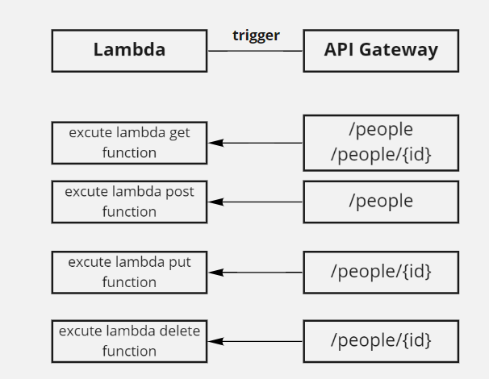

# serverless-api

### What is the root URL to your API? 

* 
[https://phucezyrlc.execute-api.us-east-1.amazonaws.com](https://phucezyrlc.execute-api.us-east-1.amazonaws.com)

### What are the routes?

| Method      |   Routes    |       
| -----------  | ----------------------------------------------------------------|
|POST | /people   |
|GET | /people   |
|GET |/people/{id}    |
|UPDATE |/people/{id}     |
|DELETE | /people/{id}    |

### What inputs do they require?

| Method      |  Input   |                                                   
| -----------  | ----------------------------------------------------------------|
|POST | JSON data in event body   |
|GET | no input    |
|GET | no input   |
|UPDATE | JSON data in event body   |
|DELETE | no input   |

### What output do they return?

| Method      |  Output   |                                                   
| -----------  | ----------------------------------------------------------------|
|POST | post object  |
|GET | all records in database   |
|GET |one record with id   |
|UPDATE | update object  |
|DELETE | empty object  |

### UML :

